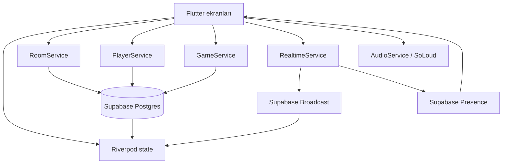

# Bets & Guesses - Güncel Oyun Mimarisi ve İletişim Altyapısı

İnceleme tarihi: 2026-07-15  
Kod tabanı: `main` / `f462726`; commitlenmiş dosya içeriği `c64087c` ile birebir aynı  
Kapsam: Flutter, Riverpod, Supabase, Realtime, timer, skor, sonuç ekranı ve SoLoud  
İnceleme kuralı: Oyun kodu ve veritabanı değiştirilmedi.

## 1. Kısa Sonuç

Mevcut sistem verimsiz fakat anlaşılabilir ve kurtarılabilir durumda:

- Kalıcı veriler Supabase tablolarında tutuluyor.
- Hızlı ekran güncellemeleri Supabase Broadcast ile taşınıyor.
- Lobide gerçekten çevrimiçi olan kişiler Presence ile belirleniyor.
- O an açık oda, oyuncu, oyun ve sayaç Riverpod belleğinde tutuluyor.
- Oyun motoru fiilen host cihaz: timer, faz geçişi, kazanan hesabı, ödeme, skor ve oyun bitişini host yürütüyor.
- Diğer cihazlar çoğunlukla Broadcast mesajlarını izliyor, gerektiğinde DB'den yeniden senkronize oluyor.

Faz ve skor için tek bir otorite yok. Aynı bilgi DB, Broadcast, Riverpod ve ekranın yerel değişkenlerinde ayrı ayrı bulunabiliyor. Bu yapı maliyetli ve kırılgan; fakat DB kayıtları sayesinde toparlanabiliyor.

Bundan sonraki çalışma tek seferde yeni bir Game Loop yazmak olmamalı. Çalışan akış korunmalı ve her sorumluluk geriye uyumlu şekilde tek tek taşınmalı.

## 2. Kullanılan Teknolojiler

- Flutter / Dart
- `flutter_riverpod`: bağımlılık ve bellek içi state yönetimi
- `go_router`: ekran geçişleri
- `supabase_flutter`: REST/PostgREST, Postgres Changes, Broadcast ve Presence
- `shared_preferences`: cihaz ID, oyuncu adı, onboarding ve mute bilgisi
- `flutter_soloud`: BGM, loop sesleri ve efektler
- RevenueCat: premium durumu

Projede şu anda `test/` klasörü ve otomatik oyun akışı testi yok.

## 3. Genel Bileşen Haritası



## 4. State Katmanları

### 4.1 Supabase'te kalıcı state

- `rooms`: oda, host, durum, tur, faz, ayarlar ve mevcut soru
- `players`: cihaz, ad, host/ready/connected, skor ve son görülme
- `questions`: soru metni, cevap, kategori, zorluk ve kaynak
- `guesses`: oyuncunun bir turdaki sayısal tahmini
- `bets`: çip, slot, miktar ve çarpan

### 4.2 Riverpod state

- `currentRoomProvider`: uygulama genelindeki tek mevcut oda
- `currentPlayerProvider`: uygulama genelindeki tek mevcut oyuncu
- `gameStateProvider`: oda anahtarı olmayan tek global `GameState`
- `gameTimerProvider`: yalnızca ekranda gösterilen saniye
- `playersStreamProvider(roomId)`: players tablosu stream'i
- `roomStreamProvider(roomId)`: rooms tablosu stream'i
- `deviceIdProvider`: SharedPreferences'ta saklanan kurulum UUID'si
- `playerNameProvider`: saklanan oyuncu adı

Oda ve oyuncu state'i yalnızca route içindeki oda kodundan tekrar kurulamaz. Home üzerinden join yapılmadan doğrudan Lobby/Game route'u açılırsa provider'lar boş kalabilir.

### 4.3 `GameScreen` içindeki yerel state

`GameScreen` ayrıca şunları kendi içinde yönetiyor:

- Dart `Timer` ve kalan saniye
- kullanılmış soru ID'leri
- tahmin input'u
- seçili çip ve seçili bahis
- istek kilitleri
- reveal animasyon timer'ları
- kazanan ve ödeme animasyon state'i
- yerel oyuncu listesi
- resync kilidi

Sonuç olarak `GameScreen` aynı anda UI, controller, timer motoru, senkronizasyon katmanı ve skor motoru görevini yapıyor.

## 5. Canlı Supabase Şeması

Aşağıdaki kolonlar canlı ortamdan yalnızca okuma istekleriyle doğrulandı.

### `rooms`

`id`, `code`, `host_id`, `status`, `current_round`, `max_rounds`, `max_players`, `category`, `round_phase`, `current_question_id`, `created_at`, `updated_at`, `state_version`, `phase_started_at`, `phase_ends_at`

### `players`

`id`, `room_id`, `device_id`, `name`, `avatar_color`, `score`, `is_host`, `is_ready`, `is_connected`, `last_seen`, `joined_at`

### `questions`

`id`, `text_tr`, `text_en`, `answer`, `answer_unit`, `category`, `difficulty`, `source`, `rating_count`, `rating_sum`

### `guesses`

`id`, `room_id`, `round_number`, `player_id`, `question_id`, `value`, `is_winner`, `created_at`

### `bets`

`id`, `room_id`, `round_number`, `player_id`, `target_guess_id`, `slot_index`, `chips`, `payout_multiplier`, `won`, `client_action_id`, `created_at`

### Kod ile canlı DB arasındaki farklar

- `rooms` içindeki yeni server-time/version kolonları canlıda var, mevcut Flutter kodu kullanmıyor.
- `bets.client_action_id` canlıda var, mevcut Flutter kodu kullanmıyor.
- Canlı `bets` tablosunda `position_x` ve `position_y` yok.
- Flutter önce bu pozisyon kolonlarıyla yazıyor, hata alınca pozisyonsuz ikinci istek gönderiyor.
- Pozisyon yalnızca anlık Broadcast mesajında yaşıyor; reconnect/resync sonrası DB'den geri gelmiyor.
- `game_server_time()` RPC'si canlıda var, mevcut Flutter kodu çağırmıyor.

RLS politikaları, Realtime publication ayarları ve grant'ler repoda migration olarak tutulmuyor. Anon key ile bunların tamamı denetlenemiyor.

## 6. Kullandığımız İletişim Yöntemleri

### 6.1 Supabase REST/PostgREST

Kalıcı okuma ve yazmalarda kullanılıyor:

- oda oluşturma, bulma, güncelleme, bitirme ve reset
- oyuncu join/upsert, ready, skor ve bağlantı durumu
- soru adaylarını ve seçilen soruyu çekme
- tahmin insert/read/winner update
- bahis insert/update/read/delete

Her istek kendi başına onaylanıyor. Birden fazla servis çağrısını kapsayan transaction yok.

### 6.2 Postgres Changes / `.stream(primaryKey:)`

Yalnızca lobide iki DB stream'i kullanılıyor:

- `playersStreamProvider(roomId)`
- `roomStreamProvider(roomId)`

Oyun sırasında room/guess/bet/score DB stream'i yok. Kaçırılan Broadcast mesajları yalnızca `_resyncFromServer()` çalışınca onarılabiliyor. Bu da çoğunlukla Game açılışında veya uygulama foreground'a dönünce oluyor.

Family stream provider'ları `autoDispose` değil. Açılmış eski oda stream'leri ProviderContainer ömrü boyunca cache'te kalabilir.

### 6.3 Supabase Broadcast

Her oda için tek topic kullanılıyor:

`room:<ODA_KODU>`

Broadcast düşük gecikmeli UI senkronizasyonu için kullanılıyor. Kalıcı bir event log değil ve replay mekanizması yok.

### 6.4 Supabase Presence

Presence yalnızca lobide şu payload ile takip ediliyor:

```text
device_id
player_id
name
```

İlk Presence sync'ten sonra aktif liste, `is_connected == true` oyuncular ile Presence device ID'lerinin kesişimi. Oyun ekranında Presence kullanılmıyor.

### 6.5 Yerel saklama

SharedPreferences içinde:

- `device_id`
- `player_name`
- `audio_muted`
- onboarding görüldü bilgisi

Device ID pratik bir uygulama kimliği; güvenli kullanıcı kimliği değil. Mevcut akışta oyuncu başına Supabase Auth session oluşturulmuyor.

## 7. Broadcast Mesaj Sözlüğü

### `game_started`

Gönderen: host Lobby  
Payload: `room_id`, `round`, `phase`, tam `question`, `scores`  
Alıcı: GameState'i başlatır, timer'ı açar ve Game'e gider.

`Question.toJson()` cevap alanını da eklediği için doğru cevap oyun başında bütün client'lara gönderiliyor.

### `phase_change`

Gönderen: host Game  
Payload: `phase`, `round`, opsiyonel tam `question`  
Alıcı: faz/tur/soruyu değiştirir, round state'i sıfırlar, timer ve sesi başlatır.

Event ID, state version kontrolü, beklenen önceki faz veya duplicate kontrolü yok.

### `guess_submitted`

Gönderen: tahmin yapan oyuncu  
Payload: yalnızca `player_id`  
Alıcı: şu an etkisiz bırakılmış auto-reveal kontrolünü çağırır. Tahmin değeri reveal'e kadar DB'de kalır.

### `guesses_revealed`

Gönderen: host  
Payload: oyuncu adı/rengi eklenmiş tüm tahminler  
Alıcı: yerel tahmin listesini değiştirir ve sıralar.

### `bet_placed`

Gönderen: çip koyan/taşıyan oyuncu  
Payload: tam bahis, DB ID ve oyuncu sunum bilgileri  
Alıcı: yerel GameState'e bahsi ekler veya günceller.

Gönderen kendi Broadcast'ini görmezden gelir; optimistic state ve REST cevabına güvenir.

### `bet_removed`

Gönderen: bahsi kaldıran oyuncu  
Payload: tercihen `bet_id`; fallback olarak `player_id` ve `slot_index`  
Alıcı: yerel bahsi kaldırır.

### `answer_revealed`

Gönderen: host  
Payload: `answer`, `winning_guess_id`  
Alıcı: cevabı açar, reveal animasyonu ve sesini başlatır.

### `score_update`

Gönderen: host  
Payload: tam `playerId -> score` map'i  
Alıcı: yerel skor map'ini tamamen değiştirir.

### `game_ended`

Gönderen: host  
Payload: boş  
Alıcı: Results ekranına gider.

### `player_left`

Gönderen: çıkan oyuncu veya kick işlemi  
Payload: `player_id`  
Alıcı: kick edilen cihaz state'i temizler ve Home'a döner. Oyuncu listesi DB stream'inden güncellenir.

### `player_joined`

Listener var fakat mevcut join akışı bu mesajı göndermiyor. Join bilgisi players stream'iyle geliyor.

## 8. Baştan Sona Veri Akışı

### 8.1 Host lobi oluşturur

1. Home mobil host ve premium limitlerini kontrol eder.
2. `RoomService` altı karakterli kod üretir.
3. Kod için `rooms` tablosuna ön kontrol sorgusu atar.
4. `host_id = 'temp'` ile oda insert eder.
5. `PlayerService.joinRoom()` players listesini okur ve hostu `(room_id, device_id)` ile upsert eder.
6. Odanın `host_id` alanı gerçek player ID ile güncellenir.
7. Current room/player provider'ları set edilir.
8. Lobby route'una geçilir.

Lobiye gitmeden önce yaklaşık en az beş DB isteği oluşur. Oda insert, player upsert ve host update tek transaction değildir; arada hata olursa yarım kayıt kalabilir.

### 8.2 Oyuncu lobiye katılır

1. Home oda koduyla en yeni kayıtları arar ve waiting odayı tercih eder.
2. Kapasite/ad kontrolü için players okunur.
3. `PlayerService.joinRoom()` aynı players listesini tekrar okur.
4. Oyuncu `(room_id, device_id)` ile upsert edilir.
5. Current room/player provider'ları set edilir.
6. Lobby route'una geçilir.

Yaklaşık en az dört DB isteği vardır. Oyuncu listesi iki kez okunur.

### 8.3 Lobi senkronizasyonu

1. Lobby açıkça bir initial players sorgusu yapar.
2. Players table stream'ini dinler.
3. Room table stream'ini dinler.
4. Broadcast kanalına katılır.
5. Presence track eder.
6. Aktif oyuncuları DB connected + Presence kesişimiyle hesaplar.

Ready değişiminde DB update, manuel players reload ve stream bildirimi aynı değişiklik için birlikte çalışır.

### 8.4 Host oyunu başlatır

1. Cache'teki hafif soru adaylarından rastgele soru seçilir.
2. Seçilen sorunun tam kaydı çekilir.
3. Oyuncular tekrar çekilir.
4. Başlangıç skorları oyuncu başına bir update ile yazılır.
5. Room `playing`, round 1, `guessing` ve question ID olarak güncellenir.
6. Host yerel GameState'i hazırlar.
7. `game_started` yayınlanır.
8. Bütün client'lar Game'e geçer.

Soru seçimini sadece host yaptığı halde her client tüm hafif soru adaylarını prefetch ediyor.

### 8.5 Game açılışı ve resync

Her client şu istekleri yapabilir:

- room read
- player read
- resync içinde ikinci player read
- guess read
- bet read
- question read
- Broadcast kanalını yeniden kurma

Resync faz, oyuncu, skor, soru, tahmin, bahis ve oyuncunun tahmin yapıp yapmadığını kurar. Doğru kalan süreyi ve kalıcı çip pozisyonunu kuramaz.

### 8.6 Tahmin fazı

1. Her client kendi 30 saniyelik Dart timer'ını başlatır.
2. Oyuncu tahmini insert-and-return ile yazar.
3. `hasSubmittedGuess` yerelde true olur.
4. Değer içermeyen `guess_submitted` yayınlanır.
5. Auto-reveal kapalıdır; host kendi timer'ını bekler.

DB unique kuralı oyuncu/tur başına tek tahmine izin verir. Client idempotency key veya retry yönetmediği için ilk istek başarılı olup cevap kaybolursa tekrar deneme hata gösterebilir.

### 8.7 Tahminleri açma ve bahis fazı

1. Host timer bittiğinde `_revealGuesses()` çalışır.
2. Host round tahminlerini DB'den okur.
3. Kendi player listesinden ad/rengi ekler.
4. Room fazını `betting` yapar.
5. Tam tahmin listesini yayınlar.
6. Faz mesajını yayınlar.
7. Her client kendi 45 saniyelik timer'ını başlatır.

### 8.8 Çip koyma ve taşıma

1. Client geçici ID ile optimistic bahis oluşturur.
2. Normalized pozisyon içeren insert/update gönderir.
3. Canlı DB eksik `position_x/position_y` nedeniyle isteği reddeder.
4. Client pozisyonsuz ikinci istek gönderir.
5. Geçici bahis DB'den dönen bahisle değiştirilir.
6. Pozisyon dahil bahis Broadcast edilir.

Normal koyma/taşıma iki DB isteği + bir Broadcast üretir. Reconnect sonrası DB satırında pozisyon yoktur.

Client başına aynı anda yalnızca bir bahis işlemi `_isBetOperationInFlight` ile kabul edilir.

### 8.9 Cevap ve skor

Host bütün hesaplamayı kendi cihazında yapar:

1. Geçmeden en yakın tahmini bulur.
2. Winning guess'i DB'de işaretler.
3. Turun bütün bahislerini DB'den okur.
4. Kazanan slot ve ödemeleri yerelde hesaplar.
5. Çipleri skordan düşer.
6. Kazançları ekler.
7. Sıfır/eksi oyuncuları 15'e çeker.
8. Room fazını günceller.
9. Her oyuncunun skorunu ayrı DB update ile yazar.
10. Cevabı yayınlar.
11. Skorları yayınlar.
12. Fazı yayınlar.
13. Altı saniye sonra sonraki turu planlar.

Bu işlemler transaction değildir. Ağ hatasında winner ve room fazı yazılmışken skorların yalnızca bir kısmı yazılmış olabilir.

Mevcut akış `bets.won` kolonunu güncellemiyor.

### 8.10 Sonraki tur ve oyun bitişi

- Host bellekteki used-question listesiyle yeni soru seçer.
- `getUsedQuestionIds()` serviste olsa da host resume sırasında DB'den kullanılmıyor.
- Son turda room `finished/idle` yapılır ve `game_ended` yayınlanır.
- `game_ended` kaçırılırsa client ancak daha sonraki resync'te bittiğini anlar.

### 8.11 Oyun sonu liderlik tablosu

1. Her Results ekranı players listesini bir kez okur.
2. Skora göre yerelde sıralar.
3. Results canlı stream değildir.
4. Home'a dönüş local room/player/game state'i temizler.
5. Play Again room'u waiting/round 0/idle yapıp Lobby'ye döner.

Mevcut açıklar:

- Play Again bütün client'larda açık; yalnızca host ile sınırlı değil.
- Home'a dönüş oyuncuyu DB'de disconnected yapmıyor; ghost connected kayıt bırakabilir.
- Play Again skorları açık biçimde başlangıç değerine sıfırlamıyor.
- Eski guess/bet kayıtları oda geçmişi olarak sınırsız büyüyor.

## 9. Timer ve App Lifecycle

Gerçek timer otoritesi host cihazdır.

- `Timer.periodic` ve yerel integer kullanılır.
- DB'deki phase start/end kolonları kullanılmaz.
- Broadcast fazı taşır, deadline taşımaz.
- Mesajı alan her client tam süreyle yeni timer başlatır.
- Foreground dönüşü resync yapar ve 30/45 saniyeyi baştan başlatır.
- Host background, suspend, disconnect veya kill olursa oyun ilerlemesi durabilir.
- Non-host drift görüntüyü; host drift gerçek oyun davranışını değiştirir.

Canlı server-time kolonları ileride geriye uyumlu çözüm için uygundur. İlk aşamada eski timer silinmeden deadline varsa kullan, yoksa eski timer fallback yaklaşımı uygulanmalıdır.

## 10. SoLoud ve Ses Lifecycle

`AudioService` uygulama genelinde tek instance ve kaynakları lazy-load ediyor. Ekranlar doğrudan ses komutu veriyor.

Müzik eşleşmesi:

- app başlangıcı/Home/onboarding/paywall: main BGM
- Lobby: elevator/lobby
- question/guessing: suspense
- betting/idle: lobby
- reveal/scoring: main BGM
- Results: lobby + fanfare

Tespit edilen lifecycle sorunları:

1. Uygulama background olduğunda SoLoud'u durduran app-level observer yok.
2. `GameScreen.didChangeAppLifecycleState` yalnızca `resumed` durumunu ele alıyor.
3. Dart timer'ı cancel etmek `stopTicking()` çağırmıyor.
4. Faz/reveal geçişi timer'ı iptal ederken ticking loop açık kalabiliyor.
5. `GameScreen.dispose()` timer ve Realtime'ı kapatıyor ama ses loop'larını kapatmıyor.
6. Unmute her zaman lobby müziği başlatıyor; mevcut route/fazı bilmiyor.
7. Root ve birden fazla ekran BGM komutu verebiliyor; müziğin sahibi belli değil.
8. Gecikmeli fade/stop timer'ları service dispose sırasında takip edilip iptal edilmiyor.

Bu durum background'da veya ekran geçişinden sonra sesin sonsuza kadar devam etmesini açıklıyor. İlk işlevsel düzeltme yalnızca Audio lifecycle olmalı; oyun state'ine dokunmamalı.

## 11. Render ve Bellek Yapısı

- `game_screen.dart` yaklaşık beş bin satır ve oyun mantığının çoğunu taşıyor.
- Root `build()` bütün `gameStateProvider` ve `currentPlayerProvider` state'ini izliyor.
- Bet, skor, faz, tahmin veya cevap değişimi tüm Game ekranını rebuild edebiliyor.
- Betting board aynı büyük ekran içinde geniş provider watch kullanıyor.
- Bazı akışlar Riverpod update sonrası ayrıca `setState` çağırıyor.
- Timer göstergesi küçük bir `Consumer` içinde nispeten izole.
- Reveal animasyonlarında Timer ve `ValueNotifier` kullanımı rebuild alanını kısmen daraltıyor.
- Sesler lazy-load; bu mevcut yapının olumlu tarafı.
- Image cache 50 kayıt / 48 MB ile sınırlı ve board görselleri Game açılışında hazırlanıyor.

## 12. Maliyet ve İstek Fazlalıkları

### Yüksek getirili düzeltme noktaları

- Bet insert/move: eksik pozisyon kolonları nedeniyle iki REST write.
- Round settlement: oyuncu başına bir score update.
- Join: players listesi iki kez okunuyor.
- Game init/resync: players iki kez okunabiliyor.
- Ready toggle: update + manuel read + stream bildirimi.
- Her client tüm soru adaylarının ID/kategorisini prefetch ediyor.
- Room stream family provider'ları auto-dispose değil.
- Oda kodu oluştururken DB unique kontrolüne ek olarak ön sorgu yapılıyor.

### Mevcut faydalı optimizasyonlar

- Soru cache'i tam soru yerine yalnızca ID/kategori tutuyor.
- Seçilen soru ayrıca hydrate ediliyor.
- Çip koyma optimistic UI kullanıyor.
- Join room/device unique upsert kullanıyor.
- Score update'leri `Future.wait` ile paralel çalışıyor.
- Duplicate connected oyuncular ekranda birleştiriliyor.
- Lobby, oyuncu/Presence koleksiyonu değişmediyse `setState` yapmıyor.

## 13. Güvenilirlik ve Güvenlik Sınırları

- Oyuncu kimliği yerelde üretilen device UUID.
- Host yetkisi ağırlıklı olarak Flutter `isHostProvider` ile kontrol ediliyor.
- RLS kaynakları repoda olmadığı için DB tarafı host enforcement doğrulanamıyor.
- Doğru cevap oyun başında tüm client'lara gönderiliyor.
- Guess değerleri reveal'den önce DB'de; RLS'e bağlı olarak sorgulanabilir.
- Score/payout host client'ta hesaplanıyor.
- Broadcast event'lerinde imza, event version veya expected-state kontrolü yok.
- DB'de `state_version` ve idempotency alanı var fakat restore edilen client kullanmıyor.
- Bazı bet/audio/prefetch hataları sessizce yutuluyor; structured telemetry yok.

## 14. Şu Anda Güvenilir Çalışan Parçalar

- Temel mobil açılış ve navigation
- Kalıcı room/player/guess/bet kayıtları
- Device başına tek player upsert
- Lobby players stream + Presence filtresi
- Stabil bağlantıda host kontrollü sıralı oyun
- Foreground dönüşünde faz, soru, tahmin, bet ve skor resync'i
- Persist edilmiş player skorlarından final leaderboard

Bu nedenle güncel mobil yapı "verimsiz ama normal koşullarda çoğunlukla doğru" olarak tanımlanabilir.

## 15. Bundan Sonraki Değişiklik Kuralları

1. Her commit tek sorumluluk ve tek davranış değiştirecek.
2. Mobil ve web testi geçmeden eski fallback silinmeyecek.
3. SQL önce additive olacak; drop/cleanup daha sonra yapılacak.
4. Timer, Realtime, scoring, audio ve UI aynı committe değişmeyecek.
5. Her adımdan önce Git commit ve canlı şema varsayımı kaydedilecek.
6. Test bir host ve en az iki oyuncuyla yapılacak.
7. En az iki tam tur oynanacak; çoğu sync hatası ikinci turda çıkıyor.
8. Guessing, betting ve reveal sırasında background/foreground denenecek.
9. Bir disconnect/reconnect ve kaçırılmış Broadcast recovery denenecek.
10. Her fazda DB satırları ile görünen UI karşılaştırılacak.
11. Yeni yol release/profile testini geçmeden eski kod veya migration silinmeyecek.

## 16. Güvenli Adım Adım Yol Haritası

### Adım 0 - Baseline sözleşme ve smoke test

- Bu belge mevcut sözleşme olarak dondurulacak.
- Runtime davranışı değiştirmeyen küçük model/service testleri eklenecek.
- Mobil host + mobil/web oyuncular için tekrar edilebilir iki turluk test listesi hazırlanacak.
- Tam oyunun istek sayıları ve logları kaydedilecek.

Çıkış şartı: Optimizasyon öncesi davranış tekrar tekrar üretilebilmeli.

### Adım 1 - Yalnızca Audio lifecycle

- AudioService açık bir "istenen BGM" state'i tutacak.
- Background'da loop'lar pause/stop olacak.
- Timer/faz/ekran bitince ticking kesin kapanacak.
- Foreground'da yalnızca istenen parça devam edecek.
- Game state koduna dokunulmayacak.

Çıkış şartı: Background veya leave sonrası ses kalmayacak; mute/unmute doğru ekran müziğini koruyacak.

### Adım 2 - Bet pozisyon sözleşmesi

- Pozisyonun kalıcı oyun verisi mi, yalnızca görsel mi olduğuna karar verilecek.
- Kalıcıysa normalized kolonlar tek additive migration ile eklenecek.
- Görselse unsupported DB alanları gönderilmeyecek ve deterministic pozisyon üretilecek.
- Fallback retry ancak eski/yeni client uyumluluğu doğrulanınca kaldırılacak.

Çıkış şartı: Bet başına tek başarılı DB write; reconnect ve ikinci turda sabit çip yerleşimi.

### Adım 3 - Server deadline'ı shadow mode'da kullanma

- Yerel timer fallback kalırken `phase_started_at/phase_ends_at` yazılacak.
- Deadline varsa kalan süre ondan hesaplanacak.
- Faz ilerletme yetkisi henüz hosttan alınmayacak.

Çıkış şartı: Mobil/web foreground dönüşünde doğru kalan saniye.

### Adım 4 - Typed ve version'lı Realtime event'leri

- Mevcut callback'lerin önüne typed payload parser konacak.
- Her state event'ine room ID, round, phase ve state version eklenecek.
- Eski ve duplicate event'ler ignore edilecek.
- Kanal ve görünür davranış aynı kalacak.

Çıkış şartı: Gecikmiş birinci tur mesajı ikinci turu değiştiremeyecek.

### Adım 5 - Resync sahipliğini merkezileştirme

- Server snapshot kurma mantığı `GameScreen`den küçük controller/provider'a taşınacak.
- İlk etapta ekran callback'leri adapter olarak kalacak.
- Sadece app resume değil, Realtime reconnect sonrası da resync yapılacak.

Çıkış şartı: Client bir event kaçırıp route reload olmadan toparlanabilmeli.

### Adım 6 - Atomic faz ve settlement

- Var olan version kolonları ve ayrı ayrı denetlenecek RPC'ler kullanılacak.
- Geçiş expected room version/phase/round eşleşince yapılacak.
- Winner, scores, phase ve deadline tek transaction olacak.
- Client hesabı sonuç karşılaştırma/fallback olarak bir süre kalacak.

Çıkış şartı: Retry aynı turu iki kez skorlayamayacak veya iki kez ilerletemeyecek.

### Adım 7 - İstek maliyetini azaltma

- Duplicate join/player read'leri kaldırılacak.
- Player başına score write tek server işlemine çevrilecek.
- Room stream provider'ları auto-dispose olacak.
- Question prefetch yalnızca host veya bounded server sorgusu olacak.
- DB unique otoriteyse room-code precheck kaldırılacak.

Çıkış şartı: Görünür davranış değişmeden istek sayısı düşecek.

### Adım 8 - Render alanlarını ayırma

- Timer, question, chip bank, betting board ve score list ayrı provider-aware widget olacak.
- Küçük state parçaları `select` ile izlenecek.
- Riverpod update sonrası gereksiz `setState` kaldırılacak.

Çıkış şartı: Bet/timer tüm Game ekranını rebuild etmeyecek; profile frame süresi iyileşecek.

### Adım 9 - Results, leave ve güvenlik

- Play Again yalnızca host olacak ve skor reset davranışı açık tanımlanacak.
- Results/Home çıkışında oyuncu disconnected yapılacak.
- RLS ve migration'lar repoda version-control altına alınacak.
- Reveal öncesi doğru cevap client'a gönderilmeyecek.
- Host kaybolunca migration veya room termination kuralı belirlenecek.

Çıkış şartı: Oyun sonu ve yetki kuralları deterministik ve denetlenebilir olacak.

## 17. Her Adım İçin Zorunlu Test Matrisi

### Platformlar

- fiziksel Android host
- fiziksel Android veya emulator oyuncu
- web oyuncu

### Normal akış

- lobi oluştur/join
- ready/unready
- oyunu başlat
- tahmin gönder
- çip koy/taşı/kaldır
- timer geçişlerini bekle
- en az iki tur tamamla
- skor ve final leaderboard
- play again
- home'a dön

### Hata senaryoları

- her timed fazda host background/foreground
- her timed fazda player background/foreground
- guessing ve betting sırasında web refresh
- network disconnect/reconnect
- guess ve bet duplicate tap/retry
- leave/kick
- host leave
- kaçırılmış Broadcast sonrası resync

### Kabul kanıtı

- Flutter/Android runtime exception yok
- bütün client'larda aynı room/round/phase/question
- timer farkı en fazla bir saniye
- resync sonrası aynı guess/bet/score
- duplicate guess/bet/score mutation yok
- background/leave sonrası loop ses yok
- yalnızca kabul edilmiş baseline uyarılar dışında temiz analyze
- Android ve web build başarılı

## 18. İlk Uygulama Önerisi

Yeni bir Game Loop rewrite ile başlamamalıyız. Önce Adım 0 ile baseline testini kurmalı, ardından yalnızca SoLoud lifecycle düzeltmesini yapmalıyız. Sonra bet pozisyon sözleşmesini eşleyip server deadline'ı local fallback ile devreye almalıyız. Faz otoritesi ve skor ancak bu küçük parçalar kanıtlandıktan sonra transaction tabanlı server işlemine taşınmalı.
