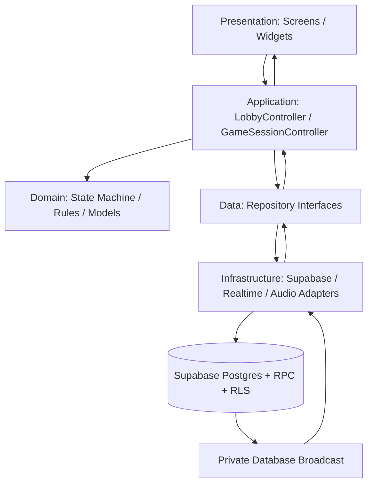
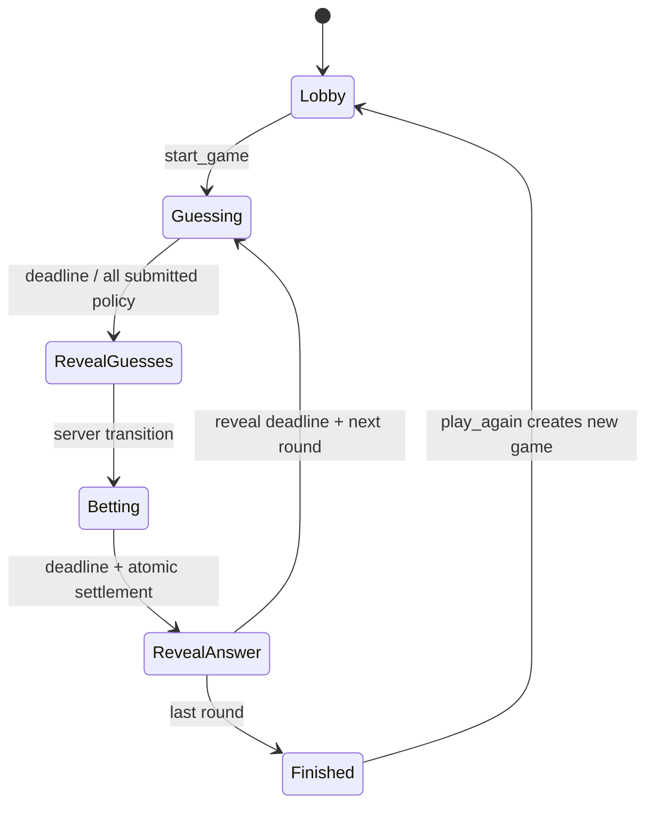

# Bets & Guesses - Hedef Oyun Mimarisi ve Eksiksiz Geçiş Yol Haritası

Hazırlanma tarihi: 2026-07-15  
Başlangıç noktası: `CURRENT_GAME_ARCHITECTURE_AUDIT.md`  
Amaç: Mobil ve webde güvenilir, düşük maliyetli, test edilebilir ve kademeli geçirilebilir üretim mimarisi  
Kural: Bu belge hedef tasarımdır; hazırlanırken uygulama kodu ve canlı Supabase değiştirilmedi.

## 1. Yönetici Özeti

Bets & Guesses için doğru hedef, her saniye çalışan özel bir game server veya pahalı bir mikroservis sistemi değildir. Oyun odaları 2-10 kişilik, aksiyon sayısı sınırlı ve faz tabanlıdır. En uygun yapı:

- Flutter'da UI, application/controller, domain ve data katmanlarını ayırmak
- Supabase Postgres'i kalıcı ve transaction tabanlı oyun otoritesi yapmak
- Her oyun komutunu doğrulanan, idempotent bir RPC üzerinden yürütmek
- Faz süresini server timestamp/deadline ile belirlemek
- Authoritative event'leri transaction sonrasında DB'den private Broadcast ile yayınlamak
- Presence'ı yalnızca geçici çevrimiçi bilgisi olarak kullanmak
- Reconnect, duplicate ve sıra dışı event'leri snapshot + version ile onarmak
- Oda ile oyun oturumunu ayırmak; her Play Again için yeni `game` oluşturmak
- Anonymous Auth + RLS ile her oyuncuya gerçek bir server kimliği vermek
- Eski client'ları bir anda kesmeden expand -> dual run -> migrate -> contract yöntemiyle ilerlemek

Bu yapı özel WebSocket sunucusu gerektirmeden profesyonel oyun motoru davranışı verir. Postgres RPC ve Realtime mevcut ölçek için yeterlidir. Edge Function yalnızca RevenueCat webhook'u, dış servis entegrasyonu veya yönetim işi gibi gerçekten secret gerektiren yerlerde kullanılmalıdır.

## 2. Piyasa ve Platform Gerçekleri

### 2.1 Mobil release gerçeği

- App Store ve Play Store client'ları aynı anda güncellenmez.
- Üretimde birkaç hafta eski ve yeni client birlikte bulunabilir.
- DB migration geri alınsa bile eski APK cihazlarda yaşamaya devam eder.
- Bu nedenle protokol ve şema değişiklikleri geriye uyumlu olmak zorundadır.
- Yeni server kodu önce eski client'ın beklediği alan/event'leri de üretmelidir.

### 2.2 Supabase maliyet gerçeği

- Realtime maliyeti mesaj hacmi ve peak connection üzerinden büyür.
- 2026-07-15 itibarıyla resmi Realtime fiyatlandırmasında kota üstü mesajlar milyon başına ücretlenir; limitler plana göre değişir.
- Timer için her saniye mesaj yayınlamak gereksiz maliyettir.
- Bir deadline event'i yayınlanır, her client kalan süreyi yerelde çizer.
- Kullanıcı aksiyonu başına tek DB transaction ve tek authoritative event hedeflenmelidir.
- Snapshot yalnızca join, reconnect, version gap veya açık kullanıcı refresh'inde alınmalıdır.

Güncel kaynaklar: [Realtime fiyatlandırma](https://supabase.com/docs/guides/realtime/pricing), [Realtime limitleri](https://supabase.com/docs/guides/realtime/limits).

### 2.3 Supabase ölçek yaklaşımı

Supabase, ölçek ve güvenlik için Postgres Changes yerine Database Broadcast kullanımını öneriyor. Postgres trigger/RPC sonrasında `realtime.broadcast_changes()` veya `realtime.send()` ile private event üretmek hedef mimariye uygundur.

Kaynaklar: [Database Changes seçenekleri](https://supabase.com/docs/guides/realtime/subscribing-to-database-changes), [Broadcast](https://supabase.com/docs/guides/realtime/broadcast).

### 2.4 Flutter mimari yaklaşımı

Flutter'ın güncel resmi yaklaşımı UI/View, ViewModel veya controller, Repository ve Service ayrımını; karmaşık işlerde ayrı domain/use-case katmanını öneriyor. Repository uygulama verisinin source of truth katmanıdır ve UI doğrudan servis çağırmamalıdır.

Kaynaklar: [Flutter uygulama mimarisi](https://docs.flutter.dev/app-architecture/guide), [Flutter mimari önerileri](https://docs.flutter.dev/app-architecture/recommendations).

### 2.5 Riverpod lifecycle yaklaşımı

Oda ID gibi parametre alan provider'larda auto-dispose kullanılmalıdır. Riverpod resmi dokümanı parametreli provider state'lerinin aksi durumda sınırsız kombinasyonla bellekte kalabileceğini belirtiyor.

Kaynak: [Riverpod automatic disposal](https://riverpod.dev/de/docs/concepts2/auto_dispose).

## 3. Hedef Kalite Sözleşmesi

### 3.1 Doğruluk

- Bir tur yalnızca bir kez settle edilir.
- Aynı command tekrar gönderilirse aynı sonuç döner; ikinci mutation oluşmaz.
- Eski event yeni round'u değiştiremez.
- Host background/kill olsa bile odada başka oyuncu varsa deadline sonrası oyun ilerleyebilir.
- Reconnect sonrası bütün client'lar aynı snapshot'a döner.
- Play Again önceki oyunun guess/bet kayıtlarıyla çakışmaz.
- Doğru cevap reveal öncesi hiçbir client payload'ında bulunmaz.

### 3.2 Senkronizasyon

- Bütün client'larda aynı `game_id`, round, phase ve `state_version`
- Görsel timer farkı normal ağda en fazla yaklaşık bir saniye
- Event gap tespitinden sonra snapshot recovery hedefi iki saniyenin altında
- Realtime event gelmese bile DB snapshot ile doğru duruma dönüş

### 3.3 Performans

- Timer tick'i sadece timer widget'ını rebuild eder.
- Bet değişimi yalnızca board/chip/bank alanlarını rebuild eder.
- Phase değişimi gereken ekran parçalarını değiştirir; beş bin satırlık ekranı baştan kurmaz.
- Bir client için oda başına tek aktif private channel
- Kullanılmayan room provider/channel/stream otomatik dispose edilir.

### 3.4 Maliyet

- Timer için network polling veya saniyelik Broadcast yok.
- Guess/bet gibi normal aksiyon başına bir RPC round trip.
- Settlement oyuncu sayısından bağımsız tek transaction/RPC.
- Non-host client soru kataloğunu indirmez.
- DB'de desteklenmeyen alanı deneyip retry etme yok.
- Presence yalnızca aktif oda süresince açık.

### 3.5 İşletilebilirlik

- Her command `action_id`, actor, game, round ve version ile loglanabilir.
- Her schema değişikliği Git migration'ıdır.
- Staging/local DB aynı migration ve seed ile kurulabilir.
- RLS, RPC ve constraint'ler pgTAP ile test edilir.
- Mobil/web smoke test CI veya release gate içinde çalışır.

## 4. Hedef Katmanlı Flutter Mimarisi



### 4.1 Presentation

Sorumlulukları:

- Widget layout
- Animasyon
- Kullanıcı input'unu controller command'ına çevirme
- State'e göre görünür/gizli alanlar
- Route geçiş isteği

Yapmaması gerekenler:

- Supabase çağrısı
- Skor hesabı
- Faz geçişi
- Realtime payload parse
- Timer otoritesi
- Audio handle yönetimi

Hedef ekranlar:

- `HomeView`
- `LobbyView`
- `GameView`
- `ResultsView`

Game içinde ayrı rebuild sınırları:

- `RoundHeader`
- `PhaseTimer`
- `QuestionPanel`
- `GuessPanel`
- `BettingBoard`
- `ChipBank`
- `PlayerScoreStrip`
- `RevealPanel`
- `RoundLeaderboard`

### 4.2 Application/controller katmanı

Riverpod `Notifier/AsyncNotifier` controller'ları:

- `appSessionControllerProvider`
- `lobbyControllerProvider(roomId)`
- `gameSessionControllerProvider(gameId)`
- `audioSessionControllerProvider`

Oda/game provider'ları parametreli ve auto-dispose olur.

`GameSessionController` sorumlulukları:

- İlk subscription + snapshot bootstrap
- Command gönderme
- Optimistic state ve server reconciliation
- Typed event uygulama
- Version gap tespiti
- Reconnect/resume snapshot
- UI state üretimi
- Domain state ile route sonucu üretme

Controller skor kuralını veya SQL doğrulamasını yeniden yazmaz; server sonucunu uygular. Domain kuralları client'ta test/preview amaçlı bulunabilir fakat authoritative değildir.

### 4.3 Domain katmanı

Flutter bağımsız saf Dart sınıfları:

- `GameSnapshot`
- `GamePhase`
- `GameConfig`
- `PublicQuestion`
- `RoundSnapshot`
- `PlayerSnapshot`
- `GuessSnapshot`
- `BetSnapshot`
- `RoundResult`
- `GameCommand`
- `GameEvent`
- `GameFailure`
- `PhaseTransitionRules`
- `PayoutRules` (server ile parity testi için)

State immutable olur. Nullable alanları gerçekten temizleyebilen açık copy/union yaklaşımı kullanılır.

### 4.4 Repository katmanı

Soyut interface'ler:

- `RoomRepository`
- `GameRepository`
- `IdentityRepository`
- `RealtimeRepository`
- `EntitlementRepository`

Repository görevleri:

- Raw JSON -> domain model
- Retry sınıflandırması
- Idempotency/action ID
- Cache
- Snapshot refresh
- Connection state
- Legacy/new protocol adapter seçimi

### 4.5 Infrastructure/service katmanı

- `SupabaseRoomDataSource`
- `SupabaseGameDataSource`
- `SupabaseIdentityDataSource`
- `SupabaseRealtimeGateway`
- `SoLoudAudioEngine`
- `RevenueCatEntitlementDataSource`
- `TelemetrySink`

Bu sınıflar domain/UI bilmez; yalnızca platform ve SDK detayını kapsüller.

## 5. Önerilen Dosya Yapısı

```text
lib/
  core/
    auth/
    errors/
    lifecycle/
    telemetry/
  features/
    room/
      domain/
      application/
      data/
      presentation/
    game/
      domain/
        game_snapshot.dart
        game_command.dart
        game_event.dart
        phase_rules.dart
      application/
        game_session_controller.dart
        game_session_state.dart
      data/
        game_repository.dart
        supabase_game_repository.dart
        realtime_gateway.dart
      presentation/
        screens/
        widgets/
    audio/
      application/
      infrastructure/
    results/
      application/
      presentation/
```

Bu klasörler tek committe oluşturulmayacak. Her taşınan davranış eski çağrıyla parity testinden sonra yer değiştirecek.

## 6. Hedef Backend Mimarisi

### 6.1 Neden dedicated server değil?

Bu oyunda sürekli fizik simülasyonu, 30-60 FPS server tick veya yüzlerce oyunculu tek arena yok. Dedicated server şu aşamada gereksiz operasyon ve maliyet getirir.

Postgres fonksiyonu/RPC şunları tek transaction içinde yapabilir:

- actor doğrulama
- room/game row lock
- phase/round/version kontrolü
- command idempotency
- guess/bet/score mutation
- deadline oluşturma
- version artırma
- sonuç snapshot/delta üretme
- commit sonrasında Realtime mesajı

Flutter SDK Postgres function'larını doğrudan RPC olarak çağırabilir: [Supabase Flutter RPC](https://supabase.com/docs/reference/dart/rpc).

### 6.2 Edge Function kullanılacak yerler

Edge Function yalnızca şu sınırlı işler için:

- RevenueCat webhook doğrulama ve entitlement sync
- secret gerektiren üçüncü taraf API
- yönetim/moderasyon işlemleri
- gerektiğinde cleanup orchestration

Temel game loop Edge Function'a taşınmaz; DB'ye yakın transaction daha basit ve ucuzdur.

## 7. Hedef Veri Modeli

### 7.1 `rooms`: kalıcı sosyal oda/lobi

Önerilen alanlar:

- `id`
- `code`
- `host_player_id`
- `status`
- `max_players`
- `default_max_rounds`
- `default_category`
- `current_game_id`
- `protocol_version`
- `created_at`
- `expires_at`

Room artık tek bir oyunun state'i değil; birden fazla Play Again oturumunu taşıyan lobby container'dır.

### 7.2 `players`: oda üyeliği

Mevcut tablo adı korunabilir; gereksiz rename yapılmaz.

Alanlar:

- mevcut player alanları
- `auth_user_id`
- `role`
- `client_protocol_version`
- `last_active_at`

`device_id` geçiş boyunca fallback olarak kalır; nihai yetki `auth_user_id` üzerinden kurulur.

### 7.3 `games`: tek bir maç/Play Again oturumu

- `id`
- `room_id`
- `status`
- `current_round`
- `max_rounds`
- `category`
- `phase`
- `state_version`
- `phase_started_at`
- `phase_ends_at`
- `current_round_id`
- `last_action_id`
- `created_at`
- `finished_at`

Her Play Again yeni `games` satırı üretir. Böylece eski round 1 ile yeni round 1 çakışmaz.

### 7.4 `game_players`: oyun başına skor

- `game_id`
- `player_id`
- `starting_score`
- `score`
- `final_rank`
- `joined_game_at`

Oda üyeliği ile oyun skoru ayrılır. `players.score` geçiş döneminde legacy mirror olarak tutulabilir.

### 7.5 `rounds`

- `id`
- `game_id`
- `round_number`
- `question_id`
- `status`
- `started_at`
- `guessing_ends_at`
- `betting_ends_at`
- `revealed_at`
- `winning_guess_id`
- `winning_slot_index`
- `settled_at`

### 7.6 `guesses`

- mevcut alanlar
- `game_id`
- `round_id`
- `client_action_id`
- unique `(game_id, round_id, player_id)`

### 7.7 `bets`

- mevcut alanlar
- `game_id`
- `round_id`
- `client_action_id`
- normalized `position_x/position_y` veya açıkça deterministic placement mode
- unique action ID

Pozisyon için önerilen karar: UI serbest yerleşim gösterdiği için normalized pozisyon kalıcı veri olmalı. Farklı ekran boyutlarında oran üzerinden çizilmelidir.

### 7.8 `round_results`

- `round_id`
- `correct_answer`
- `winning_guess_id`
- `winning_slot_index`
- payout özeti
- settlement version

Reveal öncesi bu tablo/alanlar client'a açık değildir.

### 7.9 `action_receipts` veya doğal idempotency

Guess/bet gibi tablolarda unique `client_action_id` kullanılır. Start, advance, play again gibi doğal satırı olmayan command'larda sınırlı süre tutulan action receipt kullanılabilir.

Tam event sourcing gerekli değildir. Snapshot + version + action receipt daha ucuz ve yeterlidir.

### 7.10 `questions`

- Client doğrudan answer içeren tabloyu okuyamaz.
- Public question view/RPC yalnızca metin, unit, kategori ve difficulty döndürür.
- Soru seçimini server yapar.
- Doğru cevap yalnızca settlement/reveal sonucu içinde açılır.

## 8. Hedef Command API

Her command şunları taşır:

- `action_id` UUID
- `protocol_version`
- hedef room/game
- beklenen round/phase gerektiğinde
- command'a özel payload

Önerilen RPC'ler:

- `create_room_v2(config, action_id)`
- `join_room_v2(code, name, action_id)`
- `leave_room_v2(room_id, action_id)`
- `set_ready_v2(room_id, ready, action_id)`
- `kick_player_v2(room_id, player_id, action_id)`
- `start_game_v2(room_id, action_id)`
- `submit_guess_v2(game_id, value, action_id)`
- `place_bet_v2(game_id, slot, chips, position, action_id)`
- `move_bet_v2(game_id, bet_id, slot, position, action_id)`
- `remove_bet_v2(game_id, bet_id, action_id)`
- `advance_game_if_due_v2(game_id, expected_phase, expected_round, action_id)`
- `get_game_snapshot_v2(game_id)`
- `get_results_v2(game_id)`
- `play_again_v2(room_id, action_id)`
- `claim_host_if_stale_v2(room_id, action_id)`

RPC sonucu ortak envelope:

```json
{
  "accepted": true,
  "action_id": "uuid",
  "protocol_version": 2,
  "state_version": 42,
  "server_now": "timestamp",
  "snapshot": {},
  "error": null
}
```

Hatalar typed kodlarla döner:

- `stale_state`
- `wrong_phase`
- `deadline_not_reached`
- `not_room_member`
- `not_host`
- `already_submitted`
- `insufficient_score`
- `room_full`
- `name_taken`
- `unsupported_protocol`

## 9. Hedef Oyun State Machine



Geçiş kuralları server fonksiyonunda açık whitelist olur. Client istediği fazı doğrudan yazamaz.

### Deadline davranışı

- Server `clock_timestamp()` ile `phase_ends_at` üretir.
- Client `server_now` cevabından saat offset'i hesaplar.
- UI kalan süreyi yerel ticker ile çizer.
- Ticker network mesajı üretmez.
- Deadline geldiğinde bir veya birden fazla client `advance_game_if_due` çağırabilir.
- DB row lock/version kontrolü yalnızca bir geçişi kabul eder.
- Erken çağrı server tarafından reddedilir.
- Bütün client'lar kapalıysa oyun ilerlemek zorunda değildir; ilk reconnect server'a catch-up command gönderir.

Bu yöntem host timer'ına bağlı değildir ve sürekli çalışan worker gerektirmez.

## 10. Hedef Snapshot Sözleşmesi

`GameSnapshot` tek resync kaynağıdır:

- protocol/schema version
- room ve game ID
- game status
- round/max rounds
- phase/state version
- server now
- phase start/end
- public question
- görünür faza uygun guesses
- bets ve normalized positions
- players ve game scores
- current player action durumu
- reveal fazında round result
- connection/host bilgisi

Snapshot server tarafında faza göre filtrelenir. Guess değeri ve doğru cevap client güvenliğine bırakılmaz.

## 11. Hedef Realtime Protokolü

### 11.1 Private room channel

Topic tahmin edilebilir oda kodu yerine internal ID kullanır:

`room:<room_uuid>:game:<game_uuid>`

Authenticated room member RLS politikasıyla subscribe olur.

### 11.2 Authoritative event kaynağı

- Client authoritative `phase_change` veya `score_update` yayınlamaz.
- Client RPC command gönderir.
- DB transaction state'i değiştirir.
- Transaction içindeki DB Broadcast mesajı committen sonra görünür olur.
- Event'ten önce kalıcı state oluşmuş olur.

### 11.3 Event envelope

```json
{
  "event_id": "uuid",
  "event_type": "bet.placed",
  "protocol_version": 2,
  "room_id": "uuid",
  "game_id": "uuid",
  "state_version": 42,
  "round": 3,
  "phase": "betting",
  "occurred_at": "timestamp",
  "actor_player_id": "uuid",
  "action_id": "uuid",
  "payload": {}
}
```

### 11.4 Event uygulama kuralları

- `game_id` eşleşmiyorsa ignore
- eski round ise ignore
- `state_version <= local` ise duplicate/stale olarak ignore
- `state_version == local + 1` ise event/delta uygula
- `state_version > local + 1` ise event gap; snapshot çek
- payload parse edilemiyorsa snapshot çek ve telemetry yaz

### 11.5 Güvenli bootstrap sırası

1. Private channel'a subscribe ol.
2. Subscription onaylanana kadar event'leri buffer et.
3. Snapshot çek.
4. Snapshot version'ını uygula.
5. Buffer'da daha yeni event'leri sırayla uygula.
6. Presence track et.

Bu sıra snapshot ile subscribe arasında event kaçmasını önler.

### 11.6 Presence

- Yalnızca online/typing/ready gibi ephemeral bilgi
- Kalıcı membership kaynağı değil
- Minimal payload
- Lobby ve Game çıkışında untrack
- Presence sync UI'yi değiştirir, score/phase değiştirmez

## 12. Identity, Auth ve RLS

### 12.1 Anonymous Auth

Uygulama açılışında kullanıcı hesabı istemeden `signInAnonymously()` ile Supabase kullanıcı kimliği oluşturulur. Bu kullanıcı authenticated role ve benzersiz `auth.uid()` alır.

Device ID geçiş ve cihaz içi eşleştirme için kalır; yetki kaynağı olmaz.

Kaynak: [Supabase Anonymous Sign-Ins](https://supabase.com/docs/guides/auth/auth-anonymous).

### 12.2 RLS ilkeleri

- Kullanıcı yalnızca üyesi olduğu room/game snapshot'ını görebilir.
- Oyuncu yalnızca kendi command'ını gönderebilir.
- Host command'ları DB tarafında host üyeliğiyle kontrol edilir.
- Question answer client rolüne kapalıdır.
- Direct table mutation geçiş bitince revoke edilir.
- Private Broadcast receive yalnızca room member'a açıktır.
- Policy kolonları indexlenir.
- Service/secret key client'a asla verilmez.

Kaynaklar: [Row Level Security](https://supabase.com/docs/guides/database/postgres/row-level-security), [Supabase verisini güvenli kullanma](https://supabase.com/docs/guides/database/secure-data).

### 12.3 Premium enforcement

Mevcut client-side RevenueCat kontrolü UI için kalabilir fakat server enforcement değildir.

Üretim hedefi:

1. RevenueCat entitlement değişimi webhook ile Edge Function'a gelir.
2. İmza doğrulanır.
3. Supabase `entitlements` kaydı güncellenir.
4. `create_room_v2` max player/round/category limitini DB'deki entitlement ile doğrular.

Bu yapı premium limitlerinin modifiye client ile aşılmasını engeller.

## 13. Reconnect, Offline ve Host Kaybı

### Reconnect

- Channel connection state controller'da görünür.
- Reconnect sonrası subscription beklenir ve snapshot alınır.
- Optimistic action'lar action ID ile server sonucuna bağlanır.
- Sonucu bilinmeyen command aynı action ID ile tekrar gönderilir.

### Web refresh

- Anonymous Auth session restore edilir.
- Son room/game membership serverdan bulunur veya room code route'tan çözülür.
- Provider belleğine güvenilmez.
- Snapshot ile ekran doğrudan kurulabilir.

### Mobile background

- Client timer otorite değildir.
- Background'da görsel ticker ve audio durur.
- Foreground'da server time + snapshot alınır.
- Deadline geçmişse `advance_if_due` çağrılır.

### Host kaybı

- Faz ilerletme bütün member'ların çağırabildiği güvenli RPC olduğu için oyun timer'ı hosta bağlı kalmaz.
- Start/kick/play-again gibi host komutları için host lease tutulur.
- Lease süresi dolarsa `claim_host_if_stale` deterministik yeni host seçer.
- Host tekrar gelirse yeni hostu otomatik geri alamaz.

## 14. Results ve Play Again Hedefi

- Results `game_id` bazlı immutable final snapshot'tır.
- Rank ve final score settlement transaction'ında kaydedilir.
- Bütün client'lar aynı sonuç RPC'sini görür.
- Play Again yalnızca host RPC'sidir.
- Yeni `games` ve `game_players` satırları oluşur.
- Room membership korunur.
- Ready flag'leri resetlenir.
- Önceki guess/bet/result geçmişi yeni oyunla çakışmaz.
- Home'a çıkan oyuncu server membership/connection command'ı gönderir.

## 15. Audio Hedef Mimarisi

### 15.1 Tek audio sahibi

UI doğrudan `startLobbyMusic()` çağırmaz. Application katmanı yalnızca istenen cue/state'i bildirir:

```text
silent
home
lobby
guessing
betting
reveal
results
```

`AudioSessionController` route + game phase + app lifecycle'dan tek `desiredAudioState` üretir.

### 15.2 Handle/loop kuralları

- Aynı anda tek BGM handle
- Ticking ayrı ve phase-owned loop
- Phase exit'te ticking kesin stop
- Background/inactive'de bütün loop'lar pause/stop
- Foreground'da yalnızca desired BGM resume
- Mute bütün handle'ları durdurur
- Unmute mevcut desired state'i oynatır
- Fade timer'ları kayıtlı ve dispose edilir
- SFX one-shot; uzun payout/fanfare handle'ları ekran çıkışında durdurulabilir

### 15.3 Dependency geçişi

Mevcut lock `flutter_soloud 2.1.7`; güncel paket major sürümü daha ileride. Lifecycle düzeltmesi ve package major upgrade aynı committe yapılmaz.

Sıra:

1. Mevcut sürümde owner/lifecycle davranışını düzelt.
2. Audio test matrisi oluştur.
3. Ayrı branch/committe güncel major'a yükselt.
4. Android/iOS/Web ve interruption/audio-session davranışını test et.

Güncel paket kaynağı: [flutter_soloud](https://pub.dev/packages/flutter_soloud).

## 16. Render ve State Hedefi

- `GameSessionController` tek immutable domain state üretir.
- Widget'lar `select` ile gereken alanı izler.
- Timer için ayrı auto-dispose ticker/provider kullanılır.
- Bet optimistic state controller'da tutulur; widget setState ile DB state kopyalamaz.
- Animasyon state'i ilgili küçük StatefulWidget'ta kalır.
- Game root yalnızca phase layout değişince rebuild olur.
- Room/game controller dispose olduğunda channel, timer, buffer ve stream kapanır.
- Büyük asset ve audio phase'e yakın zamanda hazırlanır.

## 17. Gözlemlenebilirlik

Vendor bağımsız `TelemetryService` interface'i:

### Structured log alanları

- app version/build
- protocol version
- platform
- room/game ID hash veya güvenli ID
- player ID hash
- action/event ID
- state version
- round/phase
- command latency
- reconnect count
- snapshot reason
- typed error code

### Ölçümler

- command success/error/latency
- Realtime connect/reconnect süresi
- event gap sayısı
- snapshot sayısı ve nedeni
- duplicate command/event sayısı
- phase drift
- DB/RPC latency
- frame jank ve memory checkpoints
- active audio voice/loop sayısı

İsim, oda kodu ve soru metni gibi kullanıcı verileri telemetry'ye varsayılan olarak gönderilmez.

## 18. Test Mimarisi

Flutter resmi yaklaşımı çok sayıda unit/widget ve kritik akışlar için yeterli integration test öneriyor: [Flutter testing overview](https://docs.flutter.dev/testing/overview).

### 18.1 Domain unit testleri

- allowed/forbidden phase transition
- payout parity
- duplicate event
- out-of-order event
- version gap
- timer remaining hesaplama
- typed payload parse
- immutable state clear/reset

### 18.2 Repository contract testleri

Legacy ve V2 repository aynı ortak davranış sözleşmesine karşı test edilir:

- join
- snapshot
- guess
- bet
- reconnect
- errors
- idempotency

### 18.3 Widget testleri

- her phase layout
- uzun oyuncu isimleri
- küçük/büyük ekran
- timer yalnız kendi widget'ını değiştirir
- disabled command state
- Results responsive liste

### 18.4 Supabase pgTAP testleri

- tablo/kolon/index/constraint
- RLS member/non-member/host
- RPC role kontrolü
- deadline erken/geç çağrı
- duplicate action
- concurrent settlement
- Play Again game isolation
- answer secrecy

Kaynaklar: [Supabase database testing](https://supabase.com/docs/guides/database/testing), [pgTAP](https://supabase.com/docs/guides/database/extensions/pgtap).

### 18.5 Multi-client integration testleri

- bir host + iki oyuncu
- Android host + Android player + Web player
- iki tam round minimum
- refresh/background/reconnect
- aynı anda bet
- duplicate command retry
- host kaybı
- Play Again
- final snapshot eşitliği

### 18.6 Performance testleri

- profile mode frame timing
- Game/board rebuild count
- app/lobby/game/results memory snapshot
- audio voice count
- bir oyun için REST/RPC ve Realtime mesaj bütçesi

## 19. Schema, Migration ve Ortam Yönetimi

Supabase'in önerdiği çalışma şekli: local/staging ortam, timestamp migration, version control ve `db push`; üretim Dashboard'unda doğrudan schema değişikliği yapmamak.

Kaynaklar: [Local development ve migrations](https://supabase.com/docs/guides/local-development/overview), [Database migrations](https://supabase.com/docs/guides/deployment/database-migrations).

Hedef repo yapısı:

```text
supabase/
  config.toml
  migrations/
  seed.sql
  tests/database/
  functions/                 # yalnız gerekiyorsa
```

Ortamlar:

- local: migration + seed + pgTAP
- staging: mobil/web multi-client QA
- production: yalnız test edilmiş migration

Üretime geçmeden:

- DB backup/PITR durumu doğrulanır.
- Migration dry run staging'de yapılır.
- Forward migration ve feature flag rollback planı yazılır.
- Destructive migration aynı release'te yapılmaz.

## 20. Feature Flag ve Protokol Uyumluluğu

Önerilen remote config alanları:

- `game_protocol_v2_enabled`
- `v2_snapshot_enabled`
- `v2_commands_enabled`
- `server_deadline_enabled`
- `database_broadcast_enabled`
- `legacy_broadcast_enabled`
- `minimum_supported_protocol`

Event ve snapshot `protocol_version` taşır.

Geçiş boyunca:

- V2 RPC legacy room/player/score alanlarını mirror eder.
- Server gerekirse V1 ve V2 event'i birlikte yayınlar.
- Yeni client V2 yoksa LegacyRepository'ye düşebilir.
- Eski client V1 alanları yaşamaya devam ettiği sürece çalışır.
- Minimum app version ancak aktif legacy oranı yeterince düştüğünde artırılır.

## 21. Expand -> Migrate -> Contract Stratejisi

### Expand

- Yeni nullable kolon/tablo/RPC ekle.
- Eski kolon ve event'lere dokunma.
- Yeni client shadow read yapar.

### Dual run

- V2 write eski alanları da mirror eder.
- Eski ve yeni hesap çıktıları karşılaştırılır.
- Feature flag küçük kullanıcı grubunda açılır.

### Migrate

- Yeni client ana path olur.
- Snapshot/version/RPC metrikleri izlenir.
- Legacy client oranı düşürülür.

### Contract

- Eski direct write yetkileri kapatılır.
- Eski event yayını durdurulur.
- Eski kolonlar ancak ayrı cleanup release'inde kaldırılır veya uzun süre read-only mirror kalır.

## 22. Eksiksiz Geçiş Yol Haritası

Her faz ayrı branch/commit grubu, test kapısı ve feature flag ile ilerler.

### Faz 0 - Kurtarma noktası ve baseline

Amaç: Değişiklik öncesi ölçülebilir referans.

Yapılacaklar:

- Çalışan Git tag/branch oluştur.
- Production DB backup/PITR durumunu doğrula.
- Mevcut schema dump/pull al.
- Mevcut iki turluk akışı video/log/request sayısıyla kaydet.
- Kabul test listesini sabitle.
- Hata telemetry interface'i ekle, vendor bağlama zorunlu değil.

Uyumluluk: Runtime davranışı değişmez.  
Rollback: Dosya/CI değişiklikleri revert edilir.  
Çıkış: Aynı baseline oyun tekrar üretilebilir.

### Faz 1 - Supabase source control temeli

Amaç: Canlı DB ile Git'i eşlemek.

Yapılacaklar:

- Supabase CLI/local stack kur.
- Canlı schema'yı baseline migration olarak çek.
- Mevcut v2 kolon/fonksiyon/index durumunu migration history ile eşle.
- Seed oluştur.
- İlk pgTAP schema/RLS smoke testlerini ekle.
- Staging project/branch oluştur.

Uyumluluk: Production şeması değiştirilmez; önce yalnız kayıt altına alınır.  
Rollback: Git migration baseline silinebilir, production etkilenmez.  
Çıkış: Local DB migration'lardan sıfırdan kurulabilir.

### Faz 2 - Audio lifecycle izolasyonu

Amaç: Mevcut bilinen kullanıcı hatasını game state'e dokunmadan çözmek.

Yapılacaklar:

- Tek audio owner/controller.
- App lifecycle pause/resume.
- Phase exit/dispose'da ticking ve loop cleanup.
- Mute/unmute desired state.
- Audio handle/fade timer cleanup.
- Android/Web background ve route testleri.

Uyumluluk: Aynı ses asset ve mevcut SoLoud major.  
Rollback: Tek audio commit revert.  
Çıkış: Background/leave sonrası ses yok.

### Faz 3 - Test seam ve repository interface

Amaç: Davranışı değiştirmeden kodu değiştirilebilir hale getirmek.

Yapılacaklar:

- Current RoomService/PlayerService/GameService arkasına repository interface koy.
- Önce adapter yalnız mevcut servisleri çağırır.
- Typed error ve DTO parse ekle.
- LegacyRepository contract testleri yaz.
- UI çağrılarını parça parça controller/repository üzerinden geçir.

Uyumluluk: Aynı REST ve Broadcast çağrıları.  
Rollback: Adapter feature flag/DI ile eski servis.  
Çıkış: UI doğrudan Supabase servislerini çağırmadan aynı oyunu oynar.

### Faz 4 - Bet pozisyonu ve düşük riskli schema eşleme

Amaç: Her betteki hata+retry ve reconnect pozisyon kaybını bitirmek.

Yapılacaklar:

- Nullable normalized position kolonlarını staging migration ile ekle.
- Eski client pozisyonsuz yazmaya devam edebilir.
- Yeni client destek keşfi veya V2 endpoint ile tek write yapar.
- Deterministic fallback pozisyonu koru.
- Round 2/reconnect testleri.

Uyumluluk: Additive kolonlar eski client'ı etkilemez.  
Rollback: Feature flag eski fallback path; kolonları hemen drop etme.  
Çıkış: Bet başına tek DB write ve kalıcı pozisyon.

### Faz 5 - Anonymous Auth ve dual identity

Amaç: RLS uygulanabilir gerçek actor identity.

Yapılacaklar:

- Anonymous Auth staging'de açılır.
- App session restore eklenir.
- `players.auth_user_id` nullable eklenir.
- Yeni join'ler auth UID + device ID yazar.
- Existing player için device fallback sürer.
- Auth/identity repository testleri.

Uyumluluk: Eski anon-key/device client çalışır.  
Rollback: Auth flag kapanır, device path kalır.  
Çıkış: Yeni client command'larında güvenilir `auth.uid()` vardır.

### Faz 6 - Oda ve oyun oturumunu ayıran additive model

Amaç: Play Again/history/round çakışmasını çözmek.

Yapılacaklar:

- `games`, `game_players`, `rounds`, `round_results` tablolarını ekle.
- Guess/bet'e nullable `game_id/round_id/action_id` ekle.
- Mevcut room kayıtları için legacy game backfill planı.
- Room current game pointer ekle.
- Legacy room phase/round/score alanlarını silme.
- Index/constraint/retention testleri.

Uyumluluk: Eski client mevcut tabloları kullanmaya devam eder.  
Rollback: V2 flag kapatılır; additive tablolar pasif kalır.  
Çıkış: Staging'de bir odada birden fazla game session tutulur.

### Faz 7 - V2 snapshot RPC ve shadow read

Amaç: Tek canonical resync sözleşmesi.

Yapılacaklar:

- `get_game_snapshot_v2` yaz.
- Faz bazlı veri filtreleme ve answer secrecy.
- Server time/version ekle.
- New client mevcut resync yanında shadow snapshot alır.
- Legacy state ile V2 snapshot karşılaştırılır, UI henüz V2'yi kullanmaz.
- Mismatch telemetry.

Uyumluluk: Kullanıcıya davranış değişikliği yok.  
Rollback: Shadow flag kapatılır.  
Çıkış: İki turluk oyunda snapshot mevcut UI state ile eşleşir.

### Faz 8 - GameSessionController extraction

Amaç: GameScreen'den state/sync sahipliğini çıkarmak.

Yapılacaklar:

- Controller bootstrap, local state ve command façade.
- İlk etapta LegacyRepository kullanır.
- GameScreen method'ları controller'a delegasyon yapar.
- Timer/reveal UI ayrı kalabilir; iş kuralı taşınır.
- Controller unit testleri.

Uyumluluk: Legacy backend ve event'ler aynı.  
Rollback: DI ile legacy screen controller adapter.  
Çıkış: GameScreen DB/Realtime payload parse etmez.

### Faz 9 - Typed V2 event ve private channel

Amaç: Mesaj sözleşmesini güvenli ve version'lı yapmak.

Yapılacaklar:

- Event envelope/parser.
- Private channel RLS.
- DB Broadcast trigger/function staging'de.
- Subscription -> snapshot -> buffered event bootstrap.
- Version gap recovery.
- Bir süre V1+V2 event birlikte yayınlanır.

Uyumluluk: Eski client V1 public/client broadcast alır; yeni client V2 private event alır.  
Rollback: `database_broadcast_enabled=false`, LegacyRealtimeGateway.  
Çıkış: Duplicate/out-of-order/missed event testleri geçer.

### Faz 10 - Server deadline shadow mode

Amaç: Timer doğruluğunu davranışı bir anda değiştirmeden kanıtlamak.

Yapılacaklar:

- V2 start/phase işlemleri server deadline yazar.
- Client hem legacy timer hem deadline timer hesaplar.
- UI önce legacy gösterir, drift telemetry kaydeder.
- Sonra flag ile deadline gösterilir; host progression legacy kalabilir.
- Background/foreground testleri.

Uyumluluk: Deadline yoksa local timer fallback.  
Rollback: UI flag legacy timer'a döner.  
Çıkış: Mobil/web resume doğru kalan süreyi gösterir.

### Faz 11 - Idempotent guess ve bet command RPC'leri

Amaç: Kullanıcı aksiyonlarını tek write ve retry-safe yapmak.

Yapılacaklar:

- `submit_guess_v2`, bet place/move/remove RPC.
- Auth, membership, phase, score ve action ID doğrulama.
- DB event transaction sonrası yayınlanır.
- Optimistic state action ID ile reconcile edilir.
- Direct table write fallback flag ile kalır.

Uyumluluk: V2 RPC legacy guess/bet satırlarını da doldurur.  
Rollback: Command flag LegacyRepository'ye döner.  
Çıkış: Duplicate retry mutation üretmez; bet tek round trip.

### Faz 12 - Join, ready, start ve leave RPC'leri

Amaç: Lobi transaction/duplicate read/yetki sorunlarını çözmek.

Yapılacaklar:

- Atomic room+host creation.
- Atomic join capacity/name/device/auth kontrolü.
- Ready/leave/kick server command.
- Start game server question selection.
- Premium entitlement enforcement hazırsa create/start kontrolü.
- Legacy alan mirror/event.

Uyumluluk: V1 tablolar/stream'ler beslenmeye devam eder.  
Rollback: V2 lobby command flag kapatılır.  
Çıkış: Join tek command; orphan room oluşmaz.

### Faz 13 - Atomic phase progression ve settlement

Amaç: Game loop otoritesini host client'tan transaction'a taşımak.

Yapılacaklar:

- `advance_game_if_due_v2` row lock/version/deadline kontrolü.
- Guessing -> reveal guesses -> betting transition.
- Betting -> winner/payout/score/result/reveal tek transaction.
- Reveal -> next round/game end transition.
- Server question selection ve answer secrecy.
- Client payout hesabı shadow parity olarak bir süre çalışır.

Uyumluluk: Legacy room phase/player score mirror ve V1 event üretilir.  
Rollback: Sadece rollout öncesi flag; aktif V2 game ortasında backend değiştirilmez. Room protocol game başında sabitlenir.  
Çıkış: Concurrent advance/settle testinde tek mutation.

### Faz 14 - Host kaybı ve reconnect recovery

Amaç: Gerçek mobil/web kesintilerine dayanıklılık.

Yapılacaklar:

- Channel reconnect state.
- Snapshot on reconnect/version gap.
- Unknown command outcome retry.
- Host lease/claim RPC.
- Web refresh membership restore.
- Mobile lifecycle catch-up.

Uyumluluk: Legacy game host kontrollü kalır; V2 game protocol room/game alanından anlaşılır.  
Rollback: Host migration flag kapatılır, V2 deadline/advance kalabilir.  
Çıkış: Host background/kill ve player refresh senaryoları geçer.

### Faz 15 - Results ve Play Again V2

Amaç: Oyun oturumu izolasyonu ve doğru final state.

Yapılacaklar:

- Immutable results RPC.
- Host-only play again.
- Yeni game/game_players oluşturma.
- Ready ve score başlangıç politikası.
- Home leave/disconnect.
- History/retention.

Uyumluluk: Legacy client için mirror room reset gerekiyorsa server yapar.  
Rollback: Yeni game oluşturulmuşsa silinmez; feature flag sonraki oyunlar için kapatılır.  
Çıkış: Aynı odada iki oyun, round 1 unique çakışması olmadan tamamlanır.

### Faz 16 - Render ve RAM optimizasyonu

Amaç: Doğruluk sabitlendikten sonra UI maliyetini düşürmek.

Yapılacaklar:

- Game widget sınırlarını ayır.
- Riverpod `select` ve autoDispose.
- Redundant setState kaldır.
- Rebuild/profile ölçümü.
- Audio asset compression/streaming değerlendirmesi.
- Image/audio cache bütçesi.

Uyumluluk: Backend/state sözleşmesi değişmez.  
Rollback: Widget bazında revert.  
Çıkış: Profile testinde frame/rebuild hedefi karşılanır.

### Faz 17 - Request, index ve retention optimizasyonu

Amaç: Üretim maliyeti ve DB sağlığı.

Yapılacaklar:

- Duplicate reads kaldır.
- Snapshot payload projection.
- RLS kolon indexleri.
- Query plan/slow query kontrolü.
- Question selection serverda bounded query.
- Abandoned room/action receipt/realtime history cleanup.
- Mesaj/request bütçesi dashboard'u.

Uyumluluk: Yalnız iç optimizasyon.  
Rollback: Query/RPC önceki sürümü tutulur.  
Çıkış: Bir oyun için tanımlı request/message bütçesi karşılanır.

### Faz 18 - RLS enforcement ve legacy write kapatma

Amaç: Server authority'yi güvenlik olarak tamamlamak.

Yapılacaklar:

- V2 RLS pgTAP tam seti.
- Client direct table mutation revoke.

- Private-only authoritative Realtime.
- Publishable key geçişi.
- Legacy client kullanım oranı ve minimum version kararı.
- Answer içeren public erişimi kapatma.

Uyumluluk: Ancak legacy oranı kabul seviyesinin altındaysa uygulanır.  
Rollback: Minimum version/legacy policy kontrollü geri açılabilir; secret açılmaz.  
Çıkış: Modifiye client host/score/answer yetkisini aşamaz.

### Faz 19 - Dependency upgrade ve teknik borç cleanup

Amaç: Davranış kanıtlandıktan sonra SDK güncellemek.

Yapılacaklar:

- SoLoud major upgrade ayrı commit.
- Supabase/Flutter/Riverpod kontrollü upgrade.
- Deprecated API temizliği.
- Legacy V1 adapter ve event'leri kullanım metriğine göre kaldırma.
- Eski room phase/score mirror kolonlarını ayrı contract migration'da değerlendirme.

Uyumluluk: Her major bağımsız release.  
Rollback: Lockfile/commit revert; destructive schema cleanup aynı release'te yok.  
Çıkış: Tüm platform build/integration testleri başarılı.

### Faz 20 - CI/CD ve üretim rollout

Amaç: Yeni sistemin sürdürülebilir işletimi.

Pipeline:

1. format/analyze
2. Dart unit test
3. widget test
4. local Supabase migration reset
5. pgTAP
6. repository integration test
7. Android/Web build
8. staging multi-client smoke
9. migration approval
10. production canary feature flag
11. metrik gözlemi
12. kademeli rollout

Çıkış: Release rollback runbook ve sahiplik tanımlı.

## 23. Geçiş Sırasında Asla Yapılmaması Gerekenler

- `GameScreen`, Realtime, timer, scoring ve SQL'i tek committe yeniden yazmak
- Production tablolarını önce drop/rename etmek
- Eski client kullanımını ölçmeden V1 event'i kapatmak
- Client Broadcast'i authoritative state olarak kabul etmek
- Her saniye timer mesajı yayınlamak
- Presence'ı kalıcı membership saymak
- Client clock ile phase geçişine karar vermek
- RevenueCat client sonucunu tek server entitlement kanıtı saymak
- Doğru cevabı reveal öncesi payload'a koymak
- Test olmadan SoLoud major upgrade ile lifecycle düzeltmesini birleştirmek
- Aktif oyun ortasında protocol değiştirmek

## 24. Karara Bağlanması Gereken Ürün Kuralları

Teknik tasarıma başlamadan şu kurallar yazılı olmalı:

1. Tahmin süresi kesin kaç saniye?
2. Bahis süresi kesin kaç saniye?
3. Reveal ekranı otomatik kaç saniye?
4. Bütün oyuncular erken bitirirse faz erken geçebilir mi?
5. Host oyundan çıkarsa host kim olur?
6. Play Again skorları her zaman 15'e mi döner?
7. Oyuna tur ortasında yeniden katılma desteklenir mi?
8. Oyuncu disconnect olursa tahmin/bet'i korunur mu?
9. Aynı oyuncu birden çok cihazdan join olabilir mi?
10. Eski game history ne kadar süre saklanır?
11. Bet pozisyonu serbest mi, deterministic mi?
12. Premium limitleri server tarafından zorunlu uygulanacak mı?

Önerilen varsayılanlar:

- Erken bitirme yok; mevcut timer davranışı korunur.
- Disconnect olan oyuncunun mevcut round aksiyonu korunur.
- Play Again yeni game oluşturur ve skorları 15'e resetler.
- Host stale lease sonrası en eski aktif oyuncuya geçer.
- Bet pozisyonu normalized olarak saklanır.
- Premium room setup serverda entitlement ile doğrulanır.
- Game history en az hata analizi dönemi kadar tutulur, sonra aggregate/cleanup yapılır.

## 25. Hedef İstek ve Mesaj Bütçesi

### Join

- bir atomic join RPC
- bir private channel subscription
- bir lobby snapshot

### Guess

- bir idempotent RPC
- bir DB Broadcast event

### Bet place/move/remove

- aksiyon başına bir idempotent RPC
- aksiyon başına bir DB Broadcast event
- drag hareketi boyunca network mesajı yok; yalnız drop/commit

### Phase

- faz başına bir authoritative transition RPC
- faz başına bir event
- saniyelik timer event'i yok

### Settlement

- oyuncu sayısından bağımsız bir transaction/RPC
- bir settlement event/snapshot version

### Reconnect

- channel resubscribe
- bir snapshot
- yalnız unresolved action varsa idempotent retry

## 26. Hedefe Ulaştığımızı Nasıl Anlarız?

Teknik kabul:

- Host cihaz kapanınca oyun kalan oyuncularla ilerliyor.
- Background dönüşü timer baştan başlamıyor.
- Aynı command 10 kez gönderilse tek mutation oluşuyor.
- İkinci tur ve Play Again veri çakışması yok.
- Client bir event kaçırıp snapshot ile toparlanıyor.
- Correct answer networkte reveal öncesi görünmüyor.
- Bet tek DB round trip ve reconnect sonrası aynı yerde.
- Settlement tek transaction.
- GameScreen business logic içermiyor.
- Room/game provider ve channel çıkışta dispose oluyor.
- Audio background/leave sonrası loop bırakmıyor.
- RLS ve RPC testleri CI'da çalışıyor.
- Production schema Git migration'larıyla tekrar kurulabiliyor.

Ürün kabul:

- Mobil host + mobil player + web player en az üç oyun arka arkaya oynuyor.
- Her oyun en az iki round.
- Refresh/background/network kesintisi kullanıcıyı yanlış faza atmıyor.
- Final leaderboard bütün cihazlarda aynı.
- Play Again güvenilir.
- Kullanıcı gözünde gecikme ve animasyon kalitesi mevcut sürümden kötü değil.

## 27. Nihai Öneri

Hedef mimariyi tek parça olarak onaylayabiliriz fakat uygulamasını tek parça yapmamalıyız. İlk gerçek çalışma sırası:

1. Faz 0 baseline
2. Faz 1 Supabase migration temeli
3. Faz 2 Audio lifecycle
4. Faz 3 repository/test seam
5. Faz 4 bet pozisyon eşleme
6. Faz 5-7 identity + game session + shadow snapshot
7. Faz 8-10 controller + typed Realtime + deadline
8. Faz 11-15 command/settlement/recovery/results
9. Faz 16-20 performans, güvenlik, cleanup ve rollout

Bu sıra hiçbir major katmanı atlamaz ve her aşamada çalışan mobil sürüme geri dönüş yolu bırakır.
